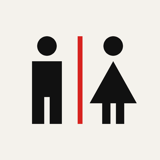
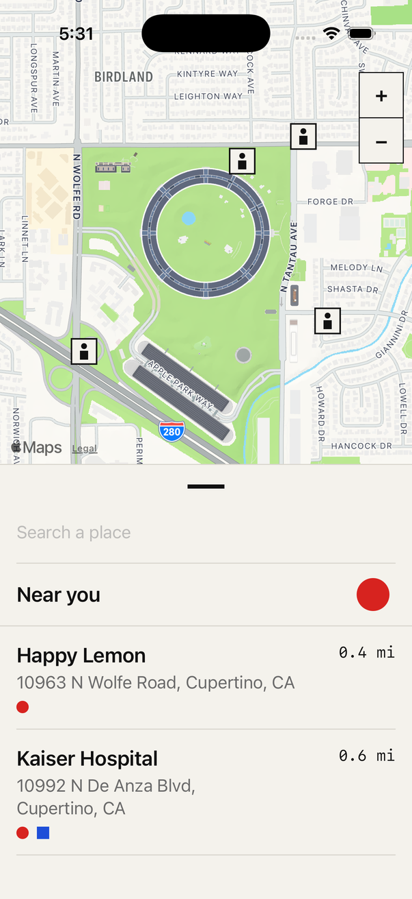
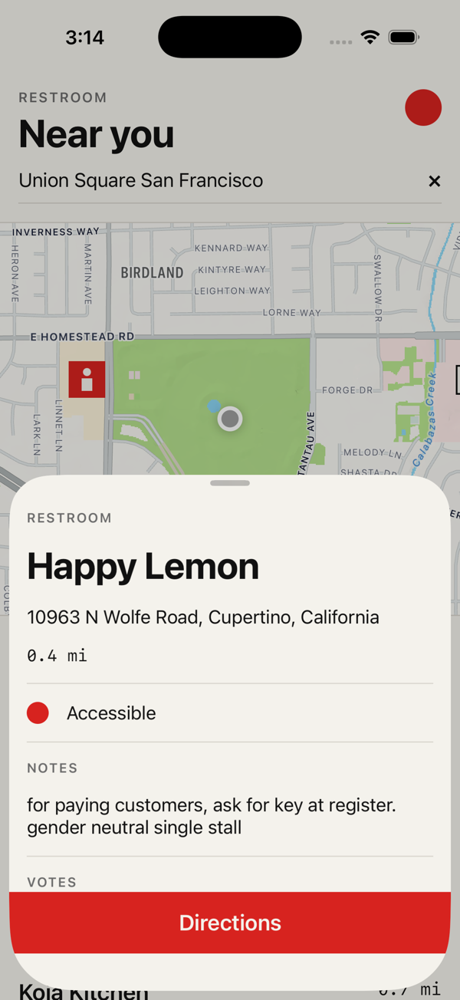

<p align="center">
  
</p>

<h1 align="center">Restroom</h1>

<p align="center">
  Find a public restroom nearby. Nothing else.<br>
  Native iPhone app · SwiftUI · iOS 17+ · open data from Refuge Restrooms
</p>

<p align="center">
  
  &nbsp;&nbsp;
  
</p>

---

## What it does

- **Nearby** — on launch, asks for your location once and lists every restroom within range, closest first.
- **Anywhere** — type a place ("Union Square San Francisco", "Penn Station") and the map and list jump there. Resolution is done on-device with `MKLocalSearch`; the restroom query then runs against that coordinate.
- **Map + list, always both** — a flat Apple Maps pane shows pictogram pins; the list below carries name, address, distance, and amenity marks. Tap either and the map centres on that pin while the list pane swaps to the detail; the map is never covered.
- **Detail** — accessibility, unisex, changing-table flags; how to find it ("back left, past the register"); community notes; vote tally; copy-address; a full-width **Directions** bar that opens Apple Maps in walking mode; and **← Nearby** to return to the list.
- **Honest states** — "Finding you…", "Loading…", "No restrooms within range.", a plain error with **Retry**, and if location is off, a one-line explanation with **Open Settings**. Search still works without location.

No accounts, no tracking, no analytics, no network calls other than the restroom query and Apple Maps.

## Design

Dieter Rams by way of the Bauhaus. The brief was *as little design as possible*; every element earns its place.

| Principle | How it shows up |
|---|---|
| One accent | Red (`#D7231F`) is the only call-to-action colour: the locate button, the selected pin, Retry, Directions. |
| Paper and ink | Warm off-white ground (`#F4F2EC`), near-black type (`#111111`), graphite for secondary text. Full dark-mode pair in the asset catalog. |
| Geometry as language | Amenities are primitives, not icons: **● red circle** = accessible, **■ blue square** = unisex, **▲ yellow triangle** = changing table. |
| Pictogram pins | Map markers are the universal restroom figure (head + body) on a paper tile with a hairline ink border. Selected pin inverts to red. |
| Grid | 8-pt unit; all padding is a multiple of 8. 1-pt hairline rules instead of cards. |
| Zero ornament | No corner radii (except the circle badge), no shadows, no gradients, no chevrons, no SF Symbols in brand elements. |
| Type | System grotesk: 34 pt bold display, 20 semibold titles, 17 body. Distances and vote counts in monospace. Section labels in tracked uppercase (`RESTROOM`, `DIRECTIONS`, `NOTES`, `VOTES`). |

The whole system lives in one file: [`Restroom/Design/Theme.swift`](Restroom/Design/Theme.swift). No view declares its own colour or font.

## Data

[Refuge Restrooms](https://www.refugerestrooms.org) — a community-maintained, open database of safe restroom access, with an emphasis on gender-neutral and accessible facilities. The app calls one endpoint:

```
GET https://www.refugerestrooms.org/api/v1/restrooms/by_location?lat=…&lng=…&per_page=50
```

Unapproved entries are dropped; results are sorted by the API's `distance` field (miles) and formatted per locale — feet under 0.1 mi, otherwise tenths of a mile (metres / kilometres for metric locales). Coverage is strongest in North America; if a search comes back empty, that is the data, not a bug. Consider [adding the restroom you found](https://www.refugerestrooms.org/restrooms/new).

## Architecture

```
Restroom/
├── Design/Theme.swift        colours, type scale, grid unit, Hairline, Badge, Triangle
├── Model/
│   ├── Restroom.swift        API model + addressLine / amenities / distanceText
│   ├── RefugeAPI.swift       actor; RestroomProvider protocol; RefugeError
│   ├── PlaceResolver.swift   MKLocalSearch behind a protocol
│   ├── LocationService.swift CLLocationManager wrapper (one-shot, when-in-use)
│   ├── FinderModel.swift     all state: center, restrooms, LoadState, selection, search
│   └── UITestSupport.swift   `-uitest` fixtures: 4 restrooms, fixed place, no network
└── UI/
    ├── RestroomApp.swift     @main; swaps in fixtures under `-uitest`
    ├── FinderView.swift      header, search field, map pane, result list, pins
    └── DetailView.swift      sheet with Directions / Copy address
RestroomTests/
├── RestroomDecodingTests.swift   decodes a fixture captured from the live API
└── FinderModelTests.swift        state transitions through a FakeProvider
RestroomUITests/
└── RestroomUITests.swift         XCUITest end-to-end flows + accessibility audits
```

Views are dumb. `FinderModel` owns every transition:

```
idle ──(location fix | search)──▶ loading ──▶ loaded
                                     ├──▶ empty
                                     └──▶ failed(message) ──Retry──▶ loading
```

`RefugeAPI` is behind the `RestroomProvider` protocol so tests inject a fake; in-flight requests are cancelled when a new centre arrives.

## Build

Requires **Xcode 26** and [xcodegen](https://github.com/yonaskolb/XcodeGen) (`brew install xcodegen`). The `.xcodeproj` is generated and git-ignored.

```sh
make test     # generate project, run unit tests on the iPhone 17 Pro simulator
make uitest   # end-to-end XCUITest suite (every screen, plus Apple's accessibility audit)
make sim      # build, install and launch on the booted simulator
```

Give the simulator a location before launching, or the list will sit on "Finding you…":

```sh
xcrun simctl location booted set 37.3349,-122.0090     # Apple Park
```

Everything in the `Makefile` exports `DEVELOPER_DIR=/Applications/Xcode.app/Contents/Developer`, so it works even if `xcode-select` still points at the command-line tools.

## Install on your iPhone

1. Sign in to Xcode with an Apple ID (a free Personal Team is enough) and set `DEVELOPMENT_TEAM` in `project.yml` if you are not the repo owner.
2. Pair the phone, enable **Developer Mode** (Settings → Privacy & Security), and unlock it.
3. `make device` — detects the UDID, builds signed, installs, launches.
4. First install only: Settings → General → VPN & Device Management → trust the developer profile, then open the app.

If `make device` reports *developer disk image could not be mounted*, the phone is locked — unlock it and run again.

## Tests

```sh
make test     # unit
make uitest   # end-to-end on the simulator
```

- **Decoding** — a two-entry fixture copied verbatim from the API (including the string-typed `bearing` and `distance` in miles) decodes to the expected amenities, metres, and address line; empty street segments are omitted.
- **Model** — empty result → `.empty`; offline error → `.failed("You're offline")`; a location fix relabels to "Near you" and loads; `reload()` without a centre stays `.idle`.
- **End-to-end** — launched with `-uitest`, the app uses `FixtureProvider` (four restrooms around Apple Park), `FixtureResolver` ("Union Square" for any query) and a simulated location authorisation, so nothing touches the network or CoreLocation. Flags: `-uitest-empty`, `-uitest-fail`, `-uitest-noplace`, `-uitest-denied`. Twelve tests drive the sorted list, row and pin taps, search, every error state, and run `performAccessibilityAudit` on home, detail, error, denied, and at the AccessibilityXXXL text size. Only MapKit's own elements (attribution, compass) are exempt from the audit.

## Accessibility

Targets WCAG 2.1 AA as applied to native apps (ADA): every type style is a Dynamic Type text style, so the whole UI scales to the accessibility sizes (rows switch to a stacked layout, nothing truncates); all tap targets are ≥ 44 × 44 pt; rows and pins are real buttons with a single spoken label ("Happy Lemon, 10963 N Wolfe Road, Cupertino, CA, 0.4 miles, Accessible") and hints; headers carry the header trait; amenity shapes are supplementary to text (and rows switch to text under *Differentiate Without Colour*); text contrast is ≥ 4.5:1 in both appearances; *Reduce Motion* recentres the map without animation.

## Licence

MIT. Restroom data © [Refuge Restrooms](https://www.refugerestrooms.org) contributors.
